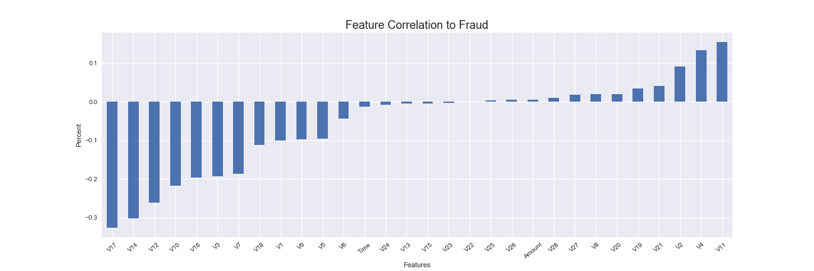

# Credit Card Fraud Detection

  

## Table of Contents

* [General Information](#general-information)
    * [Data](#data)
    * [EDA](#eda)
    * [Model](#model)
* [Technologies](#technologies)
    * [Python](#python)
    * [Visualization](#visualization)
* [Conclusion](#conclusion)
* [Future Improvements](#future-improvements)

## General Information
As we move more and more towards a cashless society, fraud detection will become increasingly important.  According to Shift Processing it is estimated that approximately $24.26 Billion dollars was lost due to payment card fraud worldwide.  It is a definite problem that needs to be addressed.  Luckily, there is such a thing as machine learning that can create a strong defense against such crimes.  I have taken a Kaggle dataset and utilized a random forest classification model to take on this problem.     

### Data:

  

Data used for this analysis was gathered from kaggle. https://www.kaggle.com/mlg-ulb/creditcardfraud.

The datasets contains transactions made by credit cards in September 2013 by european cardholders. 
These transactions occurred in two days, where we have 492 frauds out of 284,807 transactions.  This is undoubtedly a highly imbalanced dataset. Due to confidentiality issues, the file contains only numerical input variables which are the result of a PCA transformation. 

### EDA:

  

From this initial look at the data I can see that some of the features are showing stronger correlation to the fraud cases than others. This is one way to begin feature selection to begin defining my model. I can also see that on average the amount involved in fraud cases is $34 dollars higher than normal transactions. Along with that, the max amount for a fraudulant charge did not exceed $2,200.

  

Utilizing seaborn's pairplots, I can easily contrast the features density and interaction based on normal (0) or fraud (1) transactoins. 

  

### Model:
Now that I have gained some insight into our data, I can begin our model selection and testing. First I can establish the base-model. Typically this would be the time when an expert in the field would tell me what the success metric is. However, that not being the case for this project. I will start at a very basic base model. This will be done by finding the accuracy of doing nothing (AKA predicting all transactions are normal). This serves two purposes; it allows me to quantify what the true scope of the problem is, and it gives me a metric to show how much my more robust model can save the company.
<TABLE>
   <TR>    
       <TH>Action</TH>
       <TH>Outcome</TH>
   </TR>
   <TR>
      <TD>Accuracy Score of Base Model</TD>
      <TD>99.83%</TD>
   </TR>
   <TR>
      <TD>Cost of Fraud Cases Per-Day</TD>
      <TD>$30,064</TD>
   </TR>
   <TR>
      <TD>Cost of Fraud Cases Per-Year</TD>
      <TD>$21,946,720</TD>
   </TR> 
</TABLE>

## Technologies

  

###### Python:
Data Analysis: Python 3, Numpy, Pandas, Scikit-Learn, Scipy 

###### Visualization:
Data Visualization: Matplotlib, Seaborn

## Conclusion
In order to gauge the savings of our model we would have to create a cost matrix that takes into account the cost of false positive vs false negative.  This will be based on case-by-case basis.  However, the ability to utilize even the most basic random forest models and correctly classify each case is something to definitely implement.   

Ultimately, looking forward it would be great to improve our model is my incorporating more data.  Perhaps try XGBoost as well or an ensemble of methods.  Running an extensive Gridsearch could be an option.  At the end of the day the cost benifit ratio will have to be based on monetary value.  Below I have added a way to vary thresholds to get a better understanding between the precision and recall trade-off.  

## Future Improvements
• Implement a more robust feature selection method, perhaps backwards elimination 
• Try Gridsearch to find optimal hyperparameters. 
• Incorporate other models, like logistic regression and/or XGBoost 

